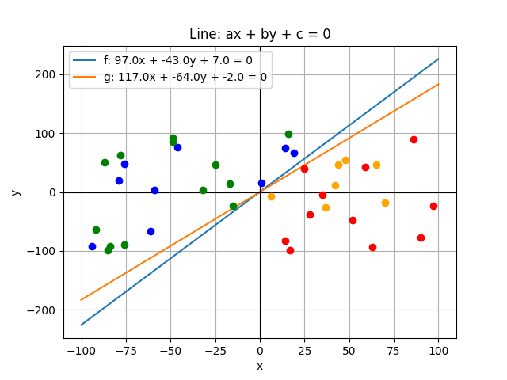

Demo PLA (Perceptron Learning Algorithm):
- Generate training and testing samples
- Implement PLA algorithm
- Draw graphic to see the result

Packages usage: 
- numpy: for numerical computing
- matplotlib: for graphic drawing

The result of PLA:



To run project. Before running, install python3, uv package management

```
uv add numpy matplotlib # Install package, run once
uv run main.py
```
